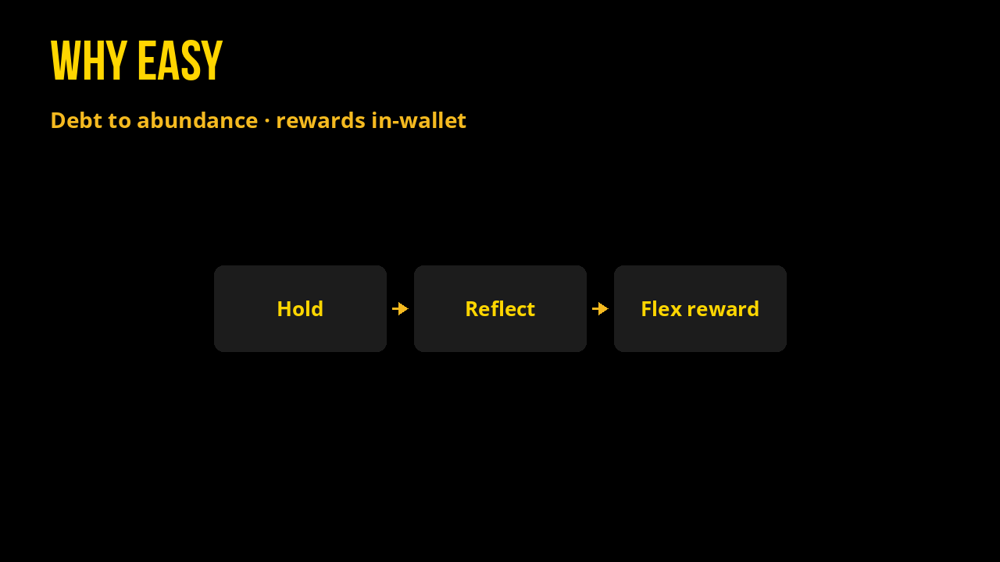

# Why EASY

Hold EASY. A 2% tax on transfers fills a pool. Anyone can press Send It. Your share lands in the wallet: as EASY, or as the token you've always wanted to DCA into daily.

No presale. 21M minted day one into stable pools. You can sell back into those same pools.

## What you get for holding

- Proportional rewards in-wallet
- Choice of reward token on flex.town (EASY, GRAMS, XBTC, 20+ others)
- Redeemable depth in XMD, XUSDC, XPYUSD, XPAX, XUSDT

Live numbers: [Market Stats](market-stats.md).  
One real bag: [Success Stories](our-story/success-stories.md).  
Who built it: [Founder Story](our-story/founder-story.md).  
The long version, in my words: [Why I Built EASY](our-story/why-i-built-easy.md).
